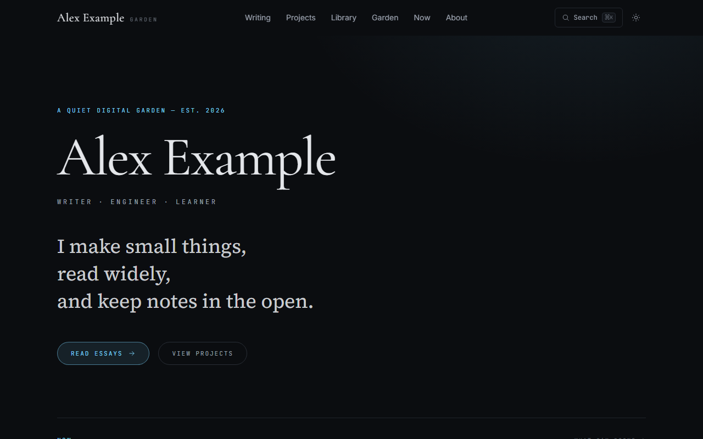

# Digital Garden Engine

**Historical engine source.** The renderer for [styayur.co.uk](https://styayur.co.uk)
has been integrated into the private `styayur/site` repository. Production builds
that repository directly; it no longer checks out this engine. This repository
is retained for source provenance, licenses, releases, issues and existing forks.
No new engine releases are planned. The documents below describe the preserved
historical engine, not the current private site's deployment or CMS contract.

**Static-first engine for personal knowledge publishing.**

[Documentation](#documentation) · [Releases](https://github.com/styayur/digital-garden-engine/releases) · [Issues](https://github.com/styayur/digital-garden-engine/issues)

[English](README.md) · [中文](README.zh-CN.md)

[](https://github.com/styayur/digital-garden-engine/releases/latest)
[](https://github.com/styayur/digital-garden-engine/actions/workflows/ci.yml)
[](LICENSE)



**Maintenance:** historical archive following verified production cutover.

An open-source, static-first digital garden engine for essays, notes, projects and personal knowledge. It is local-first, works with Markdown and MDX, produces a static website, and is designed around a clear publication boundary between public code and private content.

- **Quick start:** jump to [Run the demo in five minutes](#run-the-demo-in-five-minutes).
- **Documentation:** see the [documentation index](#documentation).
- **License:** Mozilla Public License 2.0. See [LICENSE](LICENSE).

Digital Garden Engine is licensed under MPL-2.0. Content, site configuration, writing, themes or assets supplied by users are not automatically licensed under MPL-2.0 merely because they are processed by or used with the engine.

## What it is

- A local-first authoring system for Markdown and MDX.
- A static publishing pipeline with no database required for the public site.
- A Next.js, React and TypeScript engine that can be forked and modified.
- A publication-gate design for keeping drafts and private notes outside public artifacts.
- A starter for a personal website, digital garden, writing archive or project notebook.

## What it is not

- It is not a hosted blogging service.
- It is not a CMS SaaS product.
- It is not an AI writing platform.
- It does not upload notes anywhere by itself.
- It does not promise that making a Git repository private is enough to keep content out of a public build.

## Core architecture

```text
Markdown / MDX
      │
      ▼
content:validate
      │
      ▼
Publication Gate
      │
      ▼
.build/public-content
      │
      ▼
Next.js static export
      │
      ▼
artifact:audit
      │
      ▼
Cloudflare Pages
```

The advanced architecture separates public software from private source material:

```text
PUBLIC ENGINE
styayur/digital-garden-engine
        │ pinned ref
        ▼
PRIVATE CONTENT
content/ + site.config.ts
        │
        ▼
GitHub Actions
        │ validate + stage + build + audit
        ▼
PUBLIC ARTIFACT
out/
        │
        ▼
Cloudflare Pages
```

The engine can be cloned and used by anyone. The private content repository remains private. Cloudflare receives only the generated static artifact.

## Run the demo in five minutes

You need Git and Node.js 22 or newer. Git downloads the code. Node.js runs the website on your computer.

### Windows PowerShell

```powershell
git clone https://github.com/styayur/digital-garden-engine.git
cd digital-garden-engine
npm install
npm run dev
```

### macOS or Linux

```bash
git clone https://github.com/styayur/digital-garden-engine.git
cd digital-garden-engine
npm install
npm run dev
```

Open `http://localhost:3000` in a browser. `localhost` means the website running on your own computer. Leave the terminal open while you use the site.

The demo uses fictional content from `examples/content/`.

## Prerequisites

### Git

Git is a version-control tool. This project uses it to download the engine and track changes.

Check whether Git is installed:

```bash
git --version
```

Install Git from https://git-scm.com/downloads if the command is unavailable.

### Node.js

Node.js runs the build tools. This project requires Node.js 22 or newer. Node.js 22 or 24 LTS is recommended.

Check the versions:

```bash
node --version
npm --version
```

Download Node.js from https://nodejs.org/. Reopen the terminal after installation.

## Write your first article

Create `examples/content/published/posts/hello-world.mdx`:

```md
---
title: "Hello World"
slug: "hello-world"
date: "2026-10-01"
status: "published"
description: "My first garden note."
tags:
  - hello
maturity: "seedling"
---

# Hello

This is my first note.
```

Run:

```bash
npm run dev
```

Open `http://localhost:3000/writing/hello-world`.

`maturity` is optional and describes how mature the note is. It is different from the publication `status`.

## Published, draft and private

```text
published = allowed into the public website
draft     = local or private only
private   = never allowed into a public build
```

The content contract is:

```text
content/
├── published/
│   ├── posts/
│   ├── projects/
│   ├── library/
│   └── assets/
├── drafts/
└── private/
```

A private Git repository is useful, but it is not the publication gate. The gate is the software check that decides which files may enter a public build.

The public build:

1. validates all content statuses;
2. reads only `published/`;
3. stages published content under `.build/public-content/`;
4. builds Next.js from that staging directory;
5. excludes `app/admin` and `app/api`;
6. audits the generated artifact before deployment.

Unknown values such as `publish`, `public`, `hidden` or an undefined status fail the build. They never default to published.

## Public engine plus private content

Use one repository when the engine, content and deployment configuration can all be public. Use two repositories when drafts, private notes or personal configuration must remain private.

For a personal knowledge garden, the two-repository setup is recommended:

```text
public engine repository
private content repository
GitHub Actions
Cloudflare Pages Direct Upload
```

The private repository keeps `content/`, `site.config.ts` and `engine.lock.json`. Its workflow checks out a pinned public engine revision, copies the private configuration into that checkout, and runs the same `npm run build:public` command used locally.

See [docs/private-content.md](docs/private-content.md).

## Folder structure

```text
app/          Next.js routes, layouts, metadata and the optional admin surface
components/   reusable interface components
lib/          content readers, site configuration and MDX rendering
scripts/      validation, staging, build, link checking and artifact audit
public/       static files committed to the engine
examples/     complete fictional demo content
fixtures/     publication-boundary canary fixtures
tests/        automated regression tests
docs/         architecture, deployment, schema, security and troubleshooting guides
```

Most users only need:

- `site.config.ts`
- their content directory
- their published asset directory

Most users should not need to edit:

- `scripts/`
- `lib/content-root.ts`
- the publication gate
- the artifact audit

## Commands

| Command | Purpose | When to run it | Common failure |
| --- | --- | --- | --- |
| `npm run dev` | Start the development server with staged demo content. | While writing. | Node version too old; port in use. |
| `npm run typecheck` | Check TypeScript. | Before committing. | A typed API or component changed. |
| `npm test` | Run unit and publication-boundary tests. | Before committing and in CI. | A canary crossed the boundary or a fixture is invalid. |
| `npm run content:validate` | Validate frontmatter, slugs, dates, statuses, duplicates, links and assets. | After editing content. | Invalid or unsupported frontmatter. |
| `npm run content:stage` | Build `.build/public-content/` from published entries only. | When debugging the publication gate. | A published entry is invalid. |
| `npm run build:public` | Validate, stage, static-export, check links and audit the artifact. | Before deploying. | Build, link or audit failure. |
| `npm run check:links` | Check links inside `out/`. | After a public build. | A link points to a missing page or asset. |
| `npm run artifact:audit` | Scan `out/` for leaks and forbidden files. | After a public build. | A canary, secret, source map or admin route was found. |
| `npm run build` | Build the full private/development app, including admin and APIs. | Private development only. | Not a public deployment target. |

## Customisation

Open `site.config.ts` and change:

- name
- initials
- role
- intro lines
- description
- author
- locale
- canonical URL
- terminal prompt identity
- navigation
- social links
- About profile
- Now page data

For visual changes:

- Global colour tokens: `app/globals.css`
- Tailwind theme and fonts: `tailwind.config.ts`
- Homepage composition: `app/page.tsx`
- Cards and sections: `components/`
- Command palette index: `app/layout.tsx`
- Knowledge graph: `lib/garden.ts`
- Favicon: `app/icon.svg`
- SEO and social metadata: `app/layout.tsx`, `app/sitemap.ts`, `app/robots.ts`

See [docs/customisation.md](docs/customisation.md).

## Deployment

### Recommended: Cloudflare Pages Direct Upload

Build the public artifact:

```bash
npm run build:public
```

The result is in `out/`.

With Wrangler authenticated:

```bash
npx wrangler pages project create styayur-digital-garden --production-branch main
npx wrangler pages deploy out --project-name=styayur-digital-garden --branch=main
```

Cloudflare receives only `out/`. It does not need access to the private content repository.

See [docs/deployment-cloudflare.md](docs/deployment-cloudflare.md) for the beginner walkthrough, token permissions, GitHub Secrets and rollback.

### Alternative: GitHub Pages

GitHub Pages can host `out/` if the repository or project is configured correctly. Add `.nojekyll` and preserve route folders. The engine's recommended architecture still keeps private content in a private repository and publishes only `out/`.

### Local static server

After `npm run build:public`:

```bash
cd out
python -m http.server 8080
```

Open `http://localhost:8080`.

## Cloudflare checklist

1. Create a Cloudflare account.
2. Find the Account ID under Workers & Pages.
3. Create a custom API token with **Account → Cloudflare Pages → Edit**.
4. Limit the token to the correct account.
5. Store `CLOUDFLARE_ACCOUNT_ID` and `CLOUDFLARE_API_TOKEN` as GitHub Actions secrets in the private content repository.
6. Create the Pages project.
7. Push to `main` or run the deployment workflow manually.
8. Open the Actions run and confirm validation, build and audit passed.
9. Open the `.pages.dev` URL.
10. Add a custom domain later, after the default production URL passes smoke tests.
11. Roll back from the Pages deployment history if needed.

Never commit the token to the repository.

## Upgrading a pinned engine

The private content repository should not follow `main` automatically. Change the pin deliberately:

1. Review the engine changelog.
2. Change `engine.lock.json` to a released tag or exact commit.
3. Run content validation.
4. Run the public build locally.
5. Review the artifact audit.
6. Commit the lock change.
7. Deploy.
8. Roll back the pin if the content schema changed incompatibly.

## Troubleshooting

Common symptoms and fixes are in [docs/troubleshooting.md](docs/troubleshooting.md). It covers missing npm commands, old Node versions, failed installs, port conflicts, missing articles, duplicate slugs, invalid frontmatter, broken links, missing images, Cloudflare failures, missing secrets, admin leakage, accidental draft publishing, 404s after export, missing CSS and custom-domain problems.

## Security and privacy

Never commit `.env.local`, API tokens, passwords, private keys or private content.

Do not put secrets in `NEXT_PUBLIC_*` environment variables. They are included in client-visible output.

Deleting a file from the current commit does not remove it from Git history. A repository that once contained private material should not simply be made public.

Once content is publicly deployed, assume it has been copied.

Preview URLs can also be public. This engine does not automatically publish draft branches.

Read [docs/security-model.md](docs/security-model.md) for the full threat and boundary model.

## FAQ

**Can I use this without Cloudflare?**
Yes. `npm run build:public` creates a static directory that can be hosted elsewhere.

**Can I deploy to GitHub Pages?**
Yes, but keep private content outside the public engine repository.

**Do I need a database?**
No. The public site is static.

**Can I keep my notes private?**
Yes. Put them in `drafts/` or `private/` and never bypass the publication gate.

**Can contributors see my private content?**
They can see the public engine. They cannot see a separate private repository unless you grant access.

**Can I use plain Markdown instead of MDX?**
Yes. Both `.md` and `.mdx` are supported for content entries.

**Can I remove the knowledge graph?**
Yes. Remove the component from `app/page.tsx` and the `/garden` route if you do not want it.

**Can I change fonts and theme?**
Yes. Edit `tailwind.config.ts`, `app/globals.css` and `app/layout.tsx`.

**Can I use a custom domain?**
Yes. Configure it in Cloudflare Pages after the default URL works.

**Can I use it without `/admin`?**
Yes. The public static build already excludes `/admin` and `/api`.

**Can I keep content in another repository?**
Yes. That is the recommended private-content architecture.

**Why separate engine and content?**
It keeps private material away from a public repository and gives the public artifact one auditable path.

## Documentation

- [Architecture](docs/architecture.md)
- [Private content](docs/private-content.md)
- [Cloudflare deployment](docs/deployment-cloudflare.md)
- [Content schema](docs/content-schema.md)
- [Customisation](docs/customisation.md)
- [Security model](docs/security-model.md)
- [Troubleshooting](docs/troubleshooting.md)

## Glossary

**Repository:** a Git project containing files and their version history.
**Clone:** a local copy of a repository.
**Fork:** a personal copy of someone else's repository on GitHub.
**Branch:** a named line of Git history.
**Commit:** a recorded snapshot of changes.
**Pull request:** a proposal to merge changes into a branch.
**Engine:** the reusable software in this repository.
**Content:** posts, projects, library entries and assets.
**Source of truth:** the files that must be edited to change the site.
**Dependency:** a package the project needs to run.
**Version pinning:** selecting an exact version or commit instead of always using the newest code.
**Static site:** a website made from files that do not need an application server for each request.
**Build:** the process that turns source files into a deployable site.
**Artifact:** the generated output, usually `out/`.
**Publication gate:** validation and staging software that decides what may enter a public build.
**CI:** continuous integration, usually automated checks on every push or pull request.
**CD:** continuous delivery or deployment.
**GitHub Actions:** GitHub's automation service.
**Runner:** the machine that executes a GitHub Actions job.
**Secret:** an encrypted value used by automation and never printed.
**Deployment:** publishing an artifact to a hosting service.
**Production:** the live public site.
**Preview:** a non-production deployment. Preview URLs may still be public.
**Cloudflare Pages:** a static hosting service from Cloudflare.
**Wrangler:** Cloudflare's command-line deployment tool.
**Custom domain:** a domain such as `garden.example.com`.
**Rollback:** restoring a previous deployment or code version.

## Roadmap

### Current

- Static-first MDX engine with a public-code/private-content boundary.
- Cloudflare Pages direct-upload deployment path.

### Next

- Publish a live demo and harden the documentation index.
- Document the pinned-engine upgrade path.

### Future

- A plugin/theme system and richer publication pipeline.

### Not planned

- SaaS hosting, user accounts, or analytics.

## Community

Questions, design discussion and early feedback are welcome in the Discord community:

https://discord.gg/wA2xy6VPK

This is not an SLA support channel. Security reports do not belong in Discord; use the private vulnerability reporting link in [SECURITY.md](SECURITY.md).

## Contributing

Read [CONTRIBUTING.md](CONTRIBUTING.md) and [CODE_OF_CONDUCT.md](CODE_OF_CONDUCT.md) before opening a pull request.

The project uses Dependabot for npm and GitHub Actions updates.

## License

Mozilla Public License 2.0. See [LICENSE](LICENSE).

Originally created by Stya Yur.

